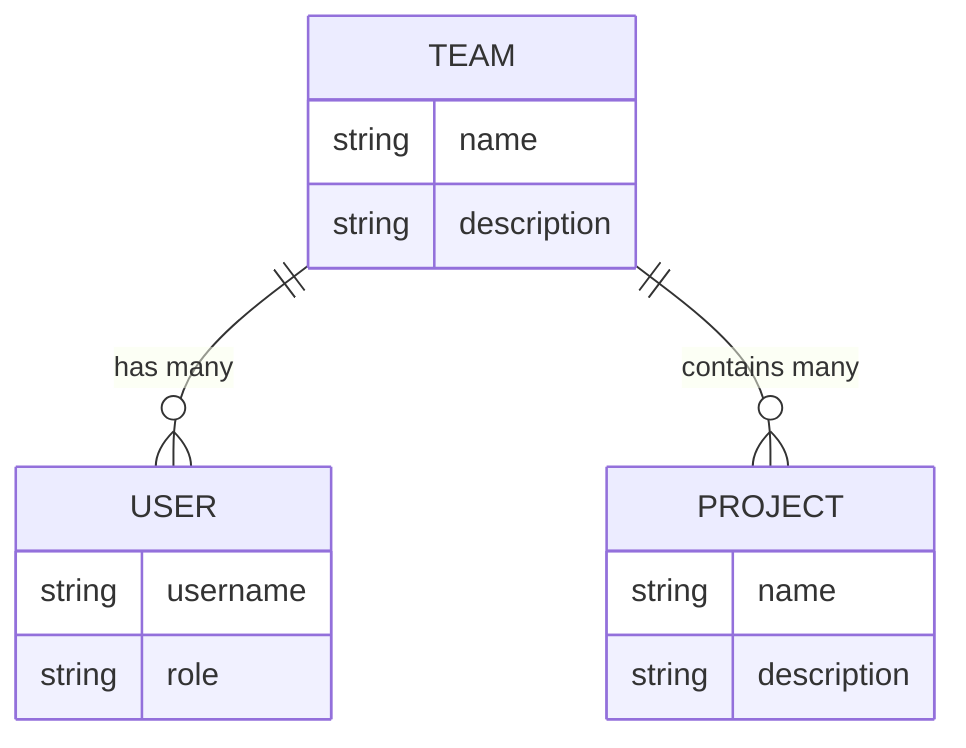

:::tip[Did you know?]
If you have an account, you already have a team. You can [visit the console](https://console.wattmaven.com/teams) to see
it.
:::

Teams enable you to organize users and collaborate efficiently on [projects](/concepts/projects). They provide a
structured way to manage
permissions, resources, and workflows across your group.

## Structure

The diagram below shows the logical relationships between teams, users, and projects.

Teams can have multiple users and multiple projects, enabling flexible organization and collaboration within your
workspace.

## Key features

- **User management**: Teams can have multiple users. Each user has a defined role with specific permissions.
- **Project management**: Teams can have multiple projects, each with its own settings and permissions.
- **Resource sharing**: Teams can share resources.
- **Billing**: Teams have their own billing settings.

## Identity

Teams each have a unique:

- **ID**: A [cuid2](https://github.com/paralleldrive/cuid2).
- **Slug**: A unique, URL-friendly identifier.

You can change the slug of a team at any time, but the ID is immutable.

:::danger
Changing the slug of a team will affect any URLs that reference it. We don't automatically redirect old URLs to new
ones, so make sure to update any bookmarks or links.

:::

## FAQ

### Who can create a team?

Every user automatically has a personal team. This team is created when you sign up for an account and is used to manage
your personal projects. **You can't delete this team.**

### When should I create a new team?

The primary use case for creating a team is to collaborate with others on a shared set of projects. If you're working on
a project with others, you should _probably_ create a shared team.

This is because teams provide their own billing settings and user management, making it easier to change these details
later on if needed.
